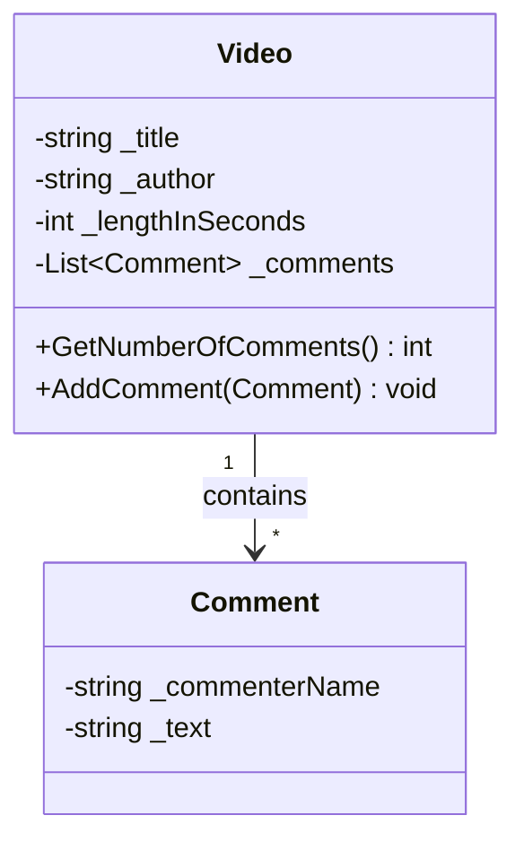
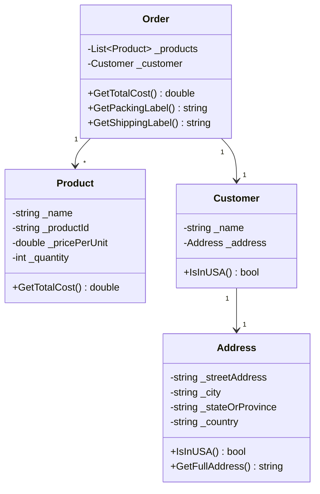

# Week 04 Class Diagrams

## YouTubeVideos (Abstraction)

```mermaid
classDiagram
    class Video {
        -string _title
        -string _author
        -int _lengthInSeconds
        -List~Comment~ _comments
        +GetNumberOfComments() int
        +AddComment(Comment) void
    }
    
    class Comment {
        -string _commenterName
        -string _text
    }
    
    Video "1" --> "*" Comment : contains
```

---

## OnlineOrdering (Encapsulation)

```mermaid
classDiagram
    class Order {
        -List~Product~ _products
        -Customer _customer
        +GetTotalCost() double
        +GetPackingLabel() string
        +GetShippingLabel() string
    }
    
    class Product {
        -string _name
        -string _productId
        -double _pricePerUnit
        -int _quantity
        +GetTotalCost() double
    }
    
    class Customer {
        -string _name
        -Address _address
        +IsInUSA() bool
    }
    
    class Address {
        -string _streetAddress
        -string _city
        -string _stateOrProvince
        -string _country
        +IsInUSA() bool
        +GetFullAddress() string
    }
    
    Order "1" --> "*" Product
    Order "1" --> "1" Customer
    Customer "1" --> "1" Address
```
